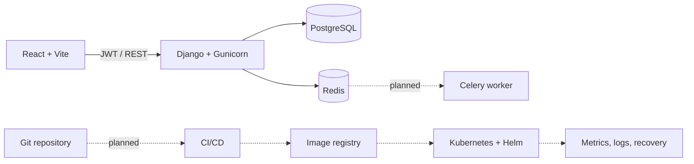

<div align="center">

# Cloud Native Inventory Platform

**A DevOps-focused full-stack and cloud-native portfolio project.**


[](LICENSE)

</div>

A DevOps-focused project that uses a real Django, React, and PostgreSQL inventory platform as the workload for a complete software delivery lifecycle.

Its primary engineering objective is to evolve that workload through containerization, CI/CD, Kubernetes, observability, centralized logging, resilience, and production operations.

## Features

- JWT authentication and group-based RBAC
- Product, warehouse, and inventory management
- Transactional order creation with historical price snapshots
- Controlled order status workflow and payment processing
- Notification service foundation and OpenAPI documentation

## Technology

**Backend:** Python · Django · Django REST Framework · PostgreSQL · SimpleJWT<br>
**Frontend:** React · TypeScript · Vite · Tailwind CSS · TanStack Query<br>
**Operations:** Docker Compose · Gunicorn · Redis · Celery (worker planned)

## DevOps Status

### Implemented

- Production-oriented Dockerfile and Gunicorn runtime
- Docker Compose with PostgreSQL persistence and Redis integration
- Environment-based configuration, health checks, and application logging

### Next Stages

- Celery worker integration, CI/CD pipeline, and image registry
- Kubernetes, Helm, Prometheus/Grafana, and centralized logging
- Backup, recovery, and resilience validation

## Architecture



Solid lines show the current application path; dashed lines show the planned cloud-native delivery path.

## Quick Start

```bash
git clone https://github.com/Mamaarsh/cloud-native-inventory-platform.git
cd cloud-native-inventory-platform
cp .env.example .env
docker compose up --build
```

The Compose stack starts the API, PostgreSQL, and Redis. Migrations run automatically; initialize RBAC roles once:

```bash
docker compose exec backend python manage.py create_roles
```

Run the frontend separately:

```bash
cd application/frontend
cp .env.example .env
npm install
npm run dev
```

API: `http://localhost:8000/api/v1/` · Swagger: `http://localhost:8000/api/docs/`

## Documentation

- [Architecture](docs/architecture.md)
- [API Reference](docs/api.md)
- [Frontend API Mapping](docs/FRONTEND_API_MAPPING.md)

## Testing

```bash
docker compose exec backend python manage.py test
cd application/frontend && npm run lint && npm run build
```

## DevOps Roadmap

- Integrate and operate Celery workers
- Build CI/CD and publish versioned images
- Deploy to Kubernetes with Helm
- Add observability, centralized logging, and recovery procedures

## Development Assistance

Codex (OpenAI) assisted with frontend implementation and development workflow support.

## License

Licensed under the [MIT License](LICENSE).

## Author

**Mohammad Arshia Jafari**