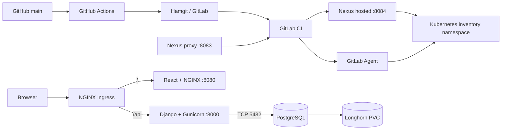

<div align="center">

# Cloud Native Inventory Platform

**A production-oriented application and a lab implementation of cloud-native delivery patterns.**


[](LICENSE)

</div>

A DevOps-focused project that uses a Django, React, and PostgreSQL inventory platform as the workload for a software delivery lifecycle. The repository currently implements container builds, GitHub-to-Hamgit pipeline triggering, GitLab CI/CD, Nexus image storage, and a security-hardened Kubernetes application deployment. Observability, centralized logging, stronger secrets management, and recovery automation remain future work.

## Features

- Registration with administrator approval, JWT authentication, and backend-enforced group RBAC
- Product and warehouse management with validated images and protected deletion
- Transactional inventory adjustments with stock-movement history and negative-stock protection
- Nested order creation, stock deduction, price snapshots, status history, and mock payment processing
- Operational dashboard, user administration, audit log, health checks, and OpenAPI documentation

## Technology

**Backend:** Python 3.14 · Django 5.2 · Django REST Framework · PostgreSQL 16 · SimpleJWT · drf-spectacular · Pillow<br>
**Frontend:** React · TypeScript · Vite · Tailwind CSS · TanStack Query<br>
**Operations:** Docker Compose · Gunicorn · NGINX · Redis/Celery configuration · Nexus Repository · GitLab CI/CD · Kubernetes · NGINX Ingress · Longhorn

## DevOps Status

### Implemented

- Application baseline: migration files through `inventory.0008_auditlog`, 246 backend test methods, and frontend lint/build checks
- Multi-stage backend/frontend images; Gunicorn on port 8000 and unprivileged NGINX on port 8080
- GitHub Actions synchronization to Hamgit and trigger-only GitLab pipelines
- Backend/frontend tests, commit-SHA and `latest` image publication to Nexus, migration Jobs, and commit-SHA Kubernetes rollouts
- Kubernetes Deployments for two backend and two frontend replicas, a single-replica PostgreSQL StatefulSet, Services, and host-based Ingress routing
- Restricted Pod Security Admission, non-root containers, dropped capabilities, RuntimeDefault seccomp, dedicated backend/frontend/migration ServiceAccounts, and default-deny NetworkPolicies
- Longhorn-backed PostgreSQL persistence using a 1 GiB `ReadWriteOnce` claim

### Next Stages

- Image/dependency vulnerability scanning and stronger secret-management integration
- Prometheus, Grafana, application/infrastructure metrics, PromQL dashboards, and alerting
- Centralized logging, backup/disaster-recovery procedures, and load/failure testing
- Celery worker and Redis deployment for Kubernetes if asynchronous delivery is retained
- Production TLS and a durable shared/object-storage design for uploaded media

## Architecture



Browser `/api` traffic goes directly from Ingress to the backend Service; the frontend pod is not an API hop. NetworkPolicies restrict the displayed application flows and required DNS. See the [architecture guide](docs/architecture.md) for security boundaries and current limitations.

## Quick Start

```bash
git clone https://github.com/Mamaarsh/cloud-native-inventory-platform.git
cd cloud-native-inventory-platform
cp .env.example .env
docker compose up --build
```

Compose defines frontend, backend, PostgreSQL, and Redis services. The backend entrypoint runs `collectstatic`; database migrations are not run automatically, so initialize the database and application roles explicitly:

```bash
docker compose exec backend python manage.py migrate
docker compose exec backend python manage.py create_roles
docker compose exec backend python manage.py createsuperuser
```

The current Compose configuration still sets the legacy `192.168.122.1:8082/base` image prefix and maps host port 80 to container port 80, while the current frontend NGINX configuration listens on 8080. Override the Nexus group for the environment and reconcile the frontend port mapping before treating Compose as a working UI runtime. Kubernetes uses the current image and port conventions described below.

For separate frontend development, start Django on `http://localhost:8000`, then configure the Vite proxy and run:

```bash
cd application/frontend
cp .env.example .env
# Add VITE_API_PROXY_TARGET=http://localhost:8000 to the untracked .env
npm ci
npm run dev
```

For the Kubernetes lab, the Ingress host is `inventory.local`; the CI environment URL records `http://inventory.local:30632`. Cluster bootstrap resources and Secrets must already exist before application deployment.

## Documentation

- [Architecture](docs/architecture.md)
- [API Reference](docs/api.md)
- [Frontend API Mapping](docs/FRONTEND_API_MAPPING.md)
- [Backend Guide](application/backend/README.md)
- [Frontend Guide](application/frontend/README.md)

## Testing

```bash
docker compose exec backend python manage.py test
cd application/frontend && npm run lint && npm run build
```

The backend source currently contains 246 test methods, and GitLab CI runs the full suite against PostgreSQL 16. The frontend has no automated test suite; CI validates linting and the TypeScript/production build. Historical manual E2E status was not independently verified during the documentation audit.

## DevOps Roadmap

- Add image/dependency vulnerability scanning and improve secrets management
- Deploy Prometheus and Grafana, then add metrics, PromQL dashboards, and alerting
- Add centralized logging
- Implement backup/disaster recovery and durable media storage
- Run load, failure, and recovery tests
- Evaluate Helm or another release-packaging workflow after the raw-manifest deployment is stable

## Development Assistance

Codex (OpenAI) assisted with frontend implementation and development workflow support.

## License

Licensed under the [MIT License](LICENSE).

## Author

**Mohammad Arshia Jafari**
