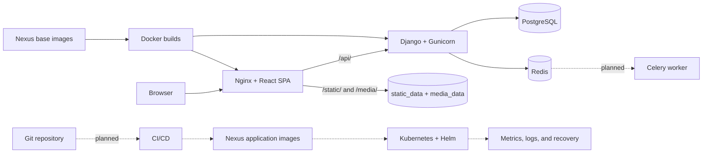

<div align="center">

# Cloud Native Inventory Platform

**A DevOps-focused full-stack and cloud-native portfolio project.**


[](LICENSE)

</div>

A DevOps-focused project that uses a real Django, React, and PostgreSQL inventory platform as the workload for a complete software delivery lifecycle. The application phase is complete and ready for application freeze.

Its primary engineering objective is to evolve that workload through containerization, CI/CD, Kubernetes, observability, centralized logging, resilience, and production operations.

## Features

- Registration with administrator approval, JWT authentication, and backend-enforced group RBAC
- Product and warehouse management with validated images and protected deletion
- Transactional inventory adjustments with stock-movement history and negative-stock protection
- Nested order creation, stock deduction, price snapshots, status history, and mock payment processing
- Operational dashboard, user administration, audit log, health checks, and OpenAPI documentation

## Technology

**Backend:** Python 3.14 · Django 5.2 · Django REST Framework · PostgreSQL 16 · SimpleJWT · drf-spectacular · Pillow<br>
**Frontend:** React · TypeScript · Vite · Tailwind CSS · TanStack Query<br>
**Operations:** Docker Compose · Gunicorn · Nginx · Redis · Nexus Repository · Celery configuration

## DevOps Status

### Implemented

- Application phase completed: migrations through `inventory.0008_auditlog`, 246 backend tests passing, and manual E2E completed
- Configurable multi-stage images, Gunicorn/Nginx runtime, and Docker Compose services for frontend, backend, PostgreSQL, and Redis
- PostgreSQL, collected static files, and uploaded media persisted in named volumes; Nginx serves static/media directly with `DEBUG=False`
- Nexus-backed base-image consumption for the current lab, environment configuration, health checks, and structured application logging

### Next Stages

- Celery worker deployment and CI/CD build/push of versioned application images to Nexus
- Kubernetes, Helm, Prometheus/Grafana, and centralized logging
- Production TLS, backup/recovery, security hardening, and resilience validation

## Architecture



Solid lines show the current application path; dashed lines show the planned cloud-native delivery path.

## Quick Start

```bash
git clone https://github.com/Mamaarsh/cloud-native-inventory-platform.git
cd cloud-native-inventory-platform
cp .env.example .env
docker compose up --build
```

The current lab pulls base images through the Nexus Docker group configured by `NEXUS_DOCKER_GROUP` (the example uses `192.168.122.1:8082/base`; replace it outside that lab). Compose starts Nginx/React, Gunicorn/Django, PostgreSQL, and Redis. Migrations and `collectstatic` run automatically; initialize RBAC roles once:

```bash
docker compose exec backend python manage.py create_roles
docker compose exec backend python manage.py createsuperuser
```

For separate frontend development, start Django on `http://localhost:8000`, then configure the Vite proxy and run:

```bash
cd application/frontend
cp .env.example .env
# Add VITE_API_PROXY_TARGET=http://localhost:8000 to the untracked .env
npm ci
npm run dev
```

Compose UI: `http://localhost/` · API: `http://localhost/api/v1/` · Swagger: `http://localhost/api/docs/`

## Documentation

- [Architecture](docs/architecture.md)
- [API Reference](docs/api.md)
- [Frontend API Mapping](docs/FRONTEND_API_MAPPING.md)
- [Backend Guide](application/backend/README.md)
- [Frontend Guide](application/frontend/README.md)

## Testing

```bash
docker compose exec backend python manage.py test
cd application/frontend && npm run lint && npm run build
```

The application-freeze baseline is 246 passing backend tests. The frontend currently has no automated test suite; it is validated with linting, TypeScript/production builds, and manual E2E testing.

## DevOps Roadmap

- Deploy and operate Celery workers
- Build CI/CD and publish versioned application images to Nexus
- Deploy to Kubernetes with Helm
- Add observability, centralized logging, and recovery procedures

## Development Assistance

Codex (OpenAI) assisted with frontend implementation and development workflow support.

## License

Licensed under the [MIT License](LICENSE).

## Author

**Mohammad Arshia Jafari**
