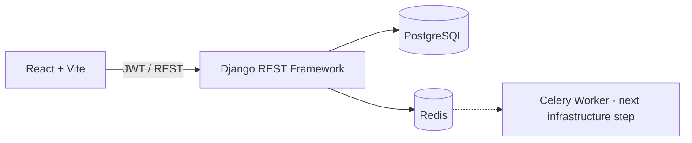

<div align="center">

# Cloud Native Inventory Platform

**Inventory and order operations built with Django REST Framework and React.**


[](LICENSE)

</div>

A production-oriented platform for managing products, warehouses, stock, orders, payments, and notifications through a secured REST API and responsive operations dashboard.

The repository currently provides the full application and a containerized local foundation. Broader deployment, delivery, and observability infrastructure remains on the roadmap.

## Features

- JWT authentication and group-based RBAC
- Product, warehouse, and inventory management
- Transactional order creation with historical price snapshots
- Controlled order status workflow and payment processing
- Redis-backed asynchronous notification support
- OpenAPI documentation and dependency-aware health checks

## Technology

**Backend:** Python · Django · Django REST Framework · PostgreSQL · SimpleJWT<br>
**Frontend:** React · TypeScript · Vite · Tailwind CSS · TanStack Query<br>
**Runtime:** Docker Compose · Gunicorn · Redis

## Project Status

**Implemented:** Full-stack application, PostgreSQL, Dockerized backend, Redis integration, health checks, and application logging.

**Planned:** CI/CD, Kubernetes, Helm, Prometheus, Grafana, and centralized logging infrastructure.

## Architecture



## Quick Start

```bash
git clone https://github.com/Mamaarsh/cloud-native-inventory-platform.git
cd cloud-native-inventory-platform
cp .env.example .env
docker compose up --build
```

The Compose stack starts the API, PostgreSQL, and Redis. Migrations run automatically; initialize RBAC roles once:

```bash
docker compose exec backend python manage.py create_roles
```

Run the frontend separately:

```bash
cd application/frontend
cp .env.example .env
npm install
npm run dev
```

API: `http://localhost:8000/api/v1/` · Swagger: `http://localhost:8000/api/docs/`

## Documentation

- [Architecture](docs/architecture.md)
- [API Reference](docs/api.md)
- [Frontend API Mapping](docs/FRONTEND_API_MAPPING.md)

## Testing

```bash
docker compose exec backend python manage.py test
cd application/frontend && npm run lint && npm run build
```

## Roadmap

- CI/CD pipeline and container registry
- Kubernetes deployment with Helm
- Prometheus and Grafana observability
- Centralized logging and recovery procedures

## Development Assistance

Codex (OpenAI) assisted with frontend implementation and development workflow support.

## License

Licensed under the [MIT License](LICENSE).

## Author

**Mohammad Arshia Jafari**
