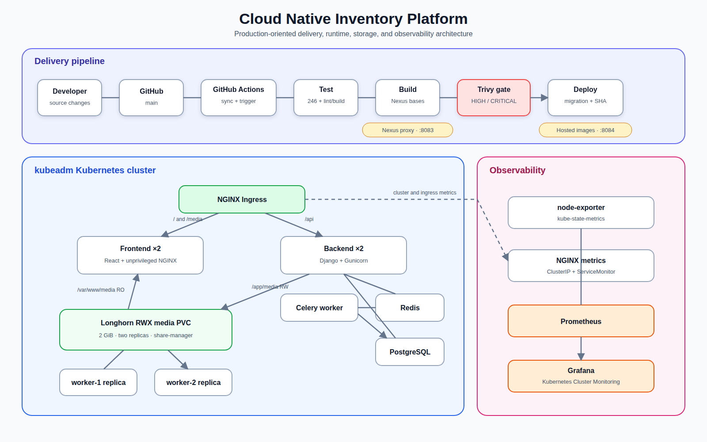
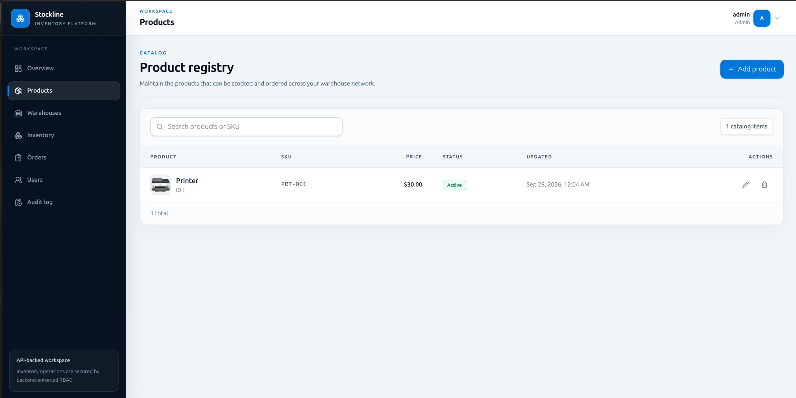
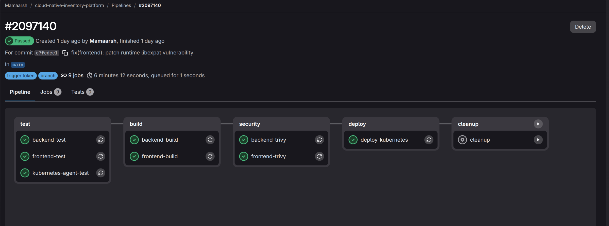
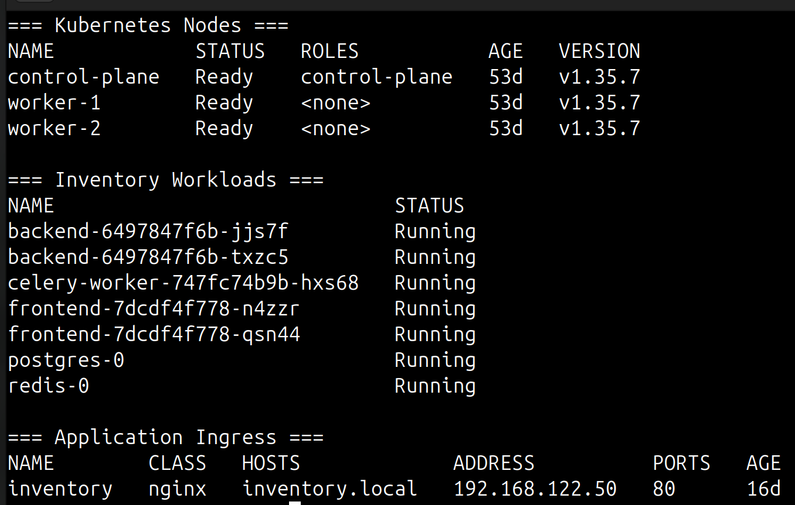
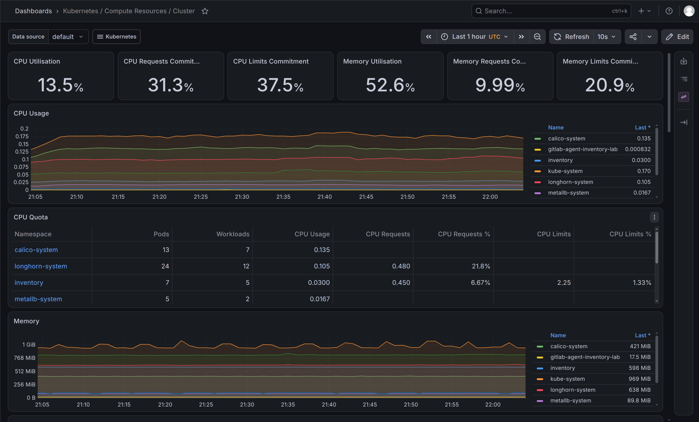
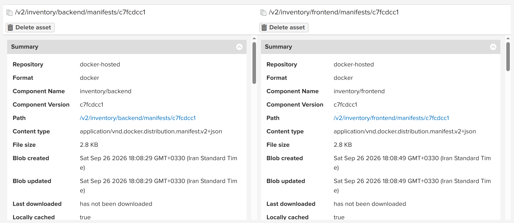

<div align="center">

# Cloud Native Inventory Platform

**An end-to-end, production-oriented DevOps portfolio project built around a real inventory and order-management workload.**


[](LICENSE)

</div>

This repository uses a Django REST API, React frontend, PostgreSQL, Redis, and Celery to demonstrate the complete delivery path from source control to hardened Kubernetes workloads and Prometheus/Grafana observability. It is a lab implementation of production-style practices: reproducible containers, CI quality gates, immutable image tags, least-privilege deployment, persistent services, network isolation, metrics discovery, and dashboards as code.

## Project at a Glance

[](docs/portfolio/linkedin/architecture.md)

The diagram separates the Nexus proxy used for CI/base images (`192.168.122.1:8083`) from the hosted application-image registry (`nexus.local:8084`). See the [portfolio architecture source](docs/portfolio/linkedin/architecture.md) and [screenshot methodology](docs/portfolio/linkedin/SCREENSHOTS.md).

## Live Project Evidence

### Application

The Stockline Product Registry is running through the Kubernetes application path and displays a persisted uploaded product thumbnail.



### CI/CD

Commit `c7fcdcc1` passed application tests, image builds, blocking Trivy security scans, and the Kubernetes deployment stage.



### Kubernetes

The control-plane and two workers are Ready; backend, frontend, Celery, PostgreSQL, and Redis workloads are Running.



### Observability

Prometheus and Grafana expose populated Kubernetes compute metrics, including the `inventory` namespace.



### Internal Registry

Backend and frontend images for commit `c7fcdcc1` are stored in the Nexus `docker-hosted` repository; CI dependency access remains a separate proxy role.



## What This Project Demonstrates

- A working web application with JWT authentication, backend-enforced role-based access, inventory transactions, order workflows, audit history, health endpoints, and OpenAPI documentation
- Multi-stage Docker builds, an unprivileged frontend NGINX runtime, Gunicorn, Compose health checks, and a public-registry local quick start
- GitHub-to-Hamgit synchronization followed by GitLab CI testing, image builds, blocking Trivy gates, Nexus publication, and commit-SHA Kubernetes releases
- A kubeadm lab architecture with NGINX Ingress, MetalLB, Longhorn-backed stateful services, Restricted Pod Security, dedicated ServiceAccounts, and default-deny NetworkPolicies
- `kube-prometheus-stack` with persistent Prometheus/Grafana storage, cluster exporters, F5 NGINX Ingress metrics, a ServiceMonitor, and a version-controlled Grafana dashboard

## Application Features

- Inactive-by-default registration, administrator approval, JWT authentication, and Admin/Warehouse Manager/Operator/Auditor roles
- Product and warehouse management, validated product images, and protected deletion of referenced records
- Atomic inventory adjustment, negative-stock prevention, movement history, nested order creation, and stock deduction
- Order status history, mock payment processing, persisted notifications with Celery delivery, and an audit-log API/UI
- Liveness, PostgreSQL-backed readiness, dependency health, Swagger UI, ReDoc, and an OpenAPI schema

## DevOps / Platform Capabilities

| Area | Implemented capability |
|---|---|
| Containers | Multi-stage backend/frontend images; Gunicorn `:8000`; unprivileged NGINX `:8080` |
| CI/CD | GitHub Action sync/trigger; GitLab test, build, security, deploy, cleanup stages |
| Supply chain | Internal Nexus proxy/hosted registries; Trivy blocks fixable HIGH/CRITICAL image findings |
| Release safety | Exact commit-SHA images, stale-release check, serialized deployment, migration-before-rollout |
| Kubernetes | Deployments, StatefulSets, Services, Ingress, probes, resources, Longhorn PVCs, NetworkPolicies |
| Workload security | Non-root users, dropped Linux capabilities, `RuntimeDefault` seccomp, read-only roots where compatible |
| Observability | Prometheus Operator, Grafana, Alertmanager, node-exporter, kube-state-metrics, NGINX metrics/dashboard |

## Architecture


```mermaid
flowchart TB
  subgraph Delivery[Application delivery]
    GH[GitHub main] --> GHA[GitHub Actions]
    GHA --> GL[Hamgit / GitLab]
    GL --> CI[GitLab CI]
    CI --> Tests[Backend tests + frontend lint/build]
    Tests --> Build[Container builds]
    Build --> Trivy[Blocking Trivy image scans]
    Trivy --> Nexus[(Nexus hosted registry)]
    Nexus --> Agent[GitLab Kubernetes Agent]
    Agent --> Migration[Commit-SHA migration Job]
    Migration --> Rollout[Backend → Celery → frontend rollout]
  end

  subgraph Runtime[Kubernetes runtime]
    Browser --> MetalLB[MetalLB / NGINX Ingress]
    MetalLB --> Frontend[React + NGINX :8080]
    MetalLB --> Backend[Django + Gunicorn :8000]
    Backend --> PostgreSQL[(PostgreSQL)]
    Backend --> Redis[(Redis)]
    Celery[Celery worker] --> Redis
    Celery --> PostgreSQL
    PostgreSQL --> AppPVC[(Longhorn PVC)]
    Redis --> AppPVC
  end

  subgraph Observability[Observability]
    NodeExporter[node-exporter]
    KSM[kube-state-metrics]
    Kubelet[kubelet / cAdvisor]
    NginxMetrics[NGINX :9113 metrics]
    ControlPlane[Control-plane metrics]
    NodeExporter --> Prometheus[(Prometheus)]
    KSM --> Prometheus
    Kubelet --> Prometheus
    NginxMetrics --> MetricsService[ClusterIP Service]
    MetricsService --> ServiceMonitor[ServiceMonitor]
    ServiceMonitor --> Prometheus
    ControlPlane --> Prometheus
    Prometheus --> Grafana[Grafana]
    Prometheus --> Alertmanager[Alertmanager]
    Prometheus --> MonitoringPVC[(Longhorn PVC)]
    Grafana --> MonitoringPVC
  end
```

See [Architecture](docs/architecture.md) for trust boundaries and known runtime constraints.

## CI/CD Pipeline

`.gitlab-ci.yml` defines the exact stages `test → build → security → deploy → cleanup`:

1. Django checks and 246 backend tests run against PostgreSQL 16; the frontend runs ESLint and a TypeScript/Vite production build; a separate job verifies the GitLab Agent and confirms the deployer cannot read Secrets.
2. Backend and frontend images are built with Nexus-proxied bases and pushed to the hosted registry with both commit-SHA and convenience `latest` tags.
3. Trivy scans each commit-SHA image and fails on fixable HIGH or CRITICAL vulnerabilities.
4. The serialized deploy job rejects confirmed stale releases, renders exact-SHA manifests, runs a uniquely named migration Job, then verifies backend, Celery, and frontend rollouts.
5. A manual cleanup job safely prunes old runner Docker data; it is not a Nexus retention policy.

The Kubernetes release never deploys `latest`. Details are in [CI/CD](docs/ci-cd.md).

## Kubernetes Architecture

The `inventory` namespace contains two frontend replicas, two backend replicas, one Celery worker, PostgreSQL and Redis StatefulSets, ClusterIP Services, and host-based Ingress routing for `inventory.local`. PostgreSQL and Redis request Longhorn `ReadWriteOnce` volumes. Product media uses the repository-defined `longhorn-media` class: a 2 GiB RWX claim with two replicas restricted to `application`-tagged disks; monitoring remains isolated on `monitoring`-tagged disks. Every node that may run a media-mounting pod requires an NFS client (`nfs-common` on Ubuntu). CI applies release-scoped application resources; namespace bootstrap, ConfigMap, StatefulSets, runtime Secrets, registry credentials, storage, Ingress, and the GitLab Agent remain explicit prerequisites.

See [Kubernetes](docs/kubernetes.md) for ownership, bootstrap order, and validation commands.

## Security

Verified repository controls include non-root processes, disabled privilege escalation, dropped capabilities, `RuntimeDefault` seccomp, dedicated ServiceAccounts with token automount disabled, Restricted Pod Security labels, resource bounds, default-deny NetworkPolicies, secret references, limited GitLab deployer RBAC, and blocking image scanning. Secrets themselves are deliberately absent from Git.

This lab does not yet provide production TLS, external secret management, JWT revocation, automated backup/recovery, or a highly available data tier. See [Security](docs/security.md).

## Observability

`k8s/monitoring/values-monitoring.yaml` configures kube-prometheus-stack 91.4.1 with Prometheus, Grafana, Alertmanager, Prometheus Operator, kube-state-metrics, and node-exporter. Prometheus retains 15 days on 5 GiB and Grafana requests 1 GiB; both use the externally managed `longhorn-monitoring` StorageClass. Monitoring images are mirrored in Nexus.

The NGINX metrics path is fully represented in Git:

```text
F5 NGINX Ingress :9113/metrics
  → nginx-ingress-metrics ClusterIP Service
  → release=monitoring ServiceMonitor
  → Prometheus Operator / Prometheus
  → Kubernetes Cluster Monitoring Grafana dashboard
```

The dashboard includes node saturation, pod resource use/restarts, NGINX request and connection rates, latency averages and p50/p95/p99, status codes, and a zero-safe 5xx percentage. See [Observability](docs/observability.md).

## Local Quick Start

Requirements: Docker Engine with Compose v2.

```bash
git clone https://github.com/Mamaarsh/cloud-native-inventory-platform.git
cd cloud-native-inventory-platform
cp .env.example .env
docker compose up --build -d
docker compose exec backend python manage.py migrate
docker compose exec backend python manage.py create_roles
docker compose exec backend python manage.py createsuperuser
```

Open `http://localhost:8080`. The example uses public Docker Hub images. For the lab proxy, set `NEXUS_DOCKER_GROUP=192.168.122.1:8083` and `NGINX_BASE_IMAGE=192.168.122.1:8083/nginxinc/nginx-unprivileged:alpine` in the untracked `.env`.

Migrations, role creation, and superuser creation are intentionally explicit. The backend image entrypoint only collects static files. The Compose stack also runs the Celery worker.

## Kubernetes Lab Deployment

This is not a one-command production installer. It expects a kubeadm cluster with a CNI implementation (Calico in the lab), default-deny-capable NetworkPolicy enforcement, NGINX Ingress, MetalLB, Longhorn, the GitLab Agent, Nexus reachability, DNS/host routing, and runtime Secrets. Start with [Kubernetes](docs/kubernetes.md); use [the Secret template](k8s/secrets.example.yaml) only as a copy-and-replace example.

Monitoring installation uses the internally mirrored chart and images documented in [k8s/monitoring/README.md](k8s/monitoring/README.md). The tracked NGINX JSON patch augments an existing F5 controller—it does not create a second controller.

## Testing

```bash
# Backend (requires PostgreSQL and environment variables)
cd application/backend
python manage.py check
python manage.py makemigrations --check --dry-run
python manage.py collectstatic --noinput
python manage.py test
python manage.py spectacular --file /tmp/schema.yml --validate

# Frontend
cd application/frontend
npm ci
npm run lint
npm run build

# Infrastructure
docker compose config --quiet
kubectl kustomize k8s/monitoring/dashboards
jq empty k8s/monitoring/dashboards/kubernetes-cluster-monitoring.json
```

The backend source contains 246 `test_*` methods. There is currently no frontend unit-test suite; CI gates it with lint and build checks.

## Repository Structure

```text
application/backend/        Django API, domain services, Celery tasks, tests
application/frontend/       React/TypeScript application and NGINX runtime
.github/workflows/          GitHub-to-Hamgit synchronization and trigger
.gitlab-ci.yml              Test, build, scan, deploy, cleanup pipeline
k8s/                        Application and platform manifests
k8s/monitoring/             Helm values, NGINX metrics, dashboard as code
docs/                       Architecture, operations, security, portfolio material
docker-compose.yml          Portable local application stack
```

## Documentation

- [Architecture](docs/architecture.md)
- [CI/CD](docs/ci-cd.md)
- [Kubernetes](docs/kubernetes.md)
- [Observability](docs/observability.md)
- [Security](docs/security.md)
- [Troubleshooting](docs/troubleshooting.md)
- [Roadmap](docs/roadmap.md)
- [API reference](docs/api.md)
- [Portfolio and LinkedIn copy](docs/portfolio/README.md)
- [Final LinkedIn presentation kit](docs/portfolio/linkedin/)

## Known Limitations / Roadmap

- Kubernetes uploads use a dedicated 2 GiB Longhorn RWX claim with two replicas on `application`-tagged disks, shared by backend writers and read-only frontend readers. Monitoring disks remain isolated. This lab path requires Longhorn RWX/share-manager support; every eligible workload node must have an NFS client; production object storage, media backup, and lifecycle automation are not implemented.
- TLS, external secret management, centralized log aggregation, custom alert notification routing, automated backups/disaster recovery, and production HA are not implemented.
- The repository does not provision the kubeadm cluster, Calico, MetalLB, Longhorn, Nexus, firewall rules, or the F5 controller installation.
- The NGINX argument patch assumes the existing controller is `nginx-ingress` and its first container is the controller; verify this lab-specific boundary before applying.
- Metrics Server is distinct from Prometheus and is not represented here; `kubectl top` therefore depends on separate installation.
- Load, failure, recovery, and live PromQL validation remain manual lab exercises.

See the prioritized [Roadmap](docs/roadmap.md).

## Author

**Mohammad Arshia Jafari**

## License

Licensed under the [MIT License](LICENSE).
