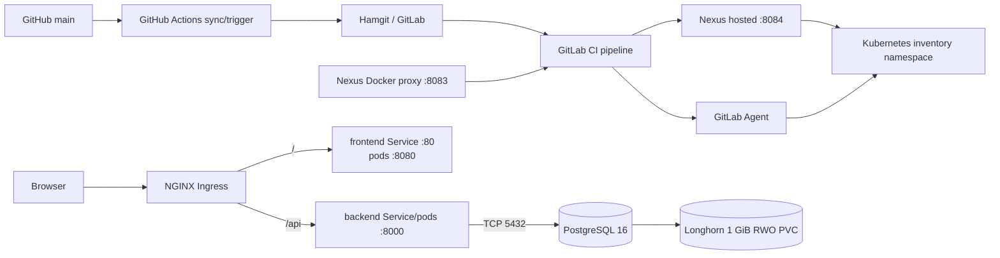
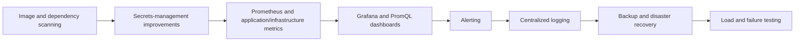

# System Architecture

## Overview

Cloud Native Inventory Platform is a full-stack operations workload for a DevOps lifecycle portfolio. The repository implements a React/Django/PostgreSQL application, container builds, Nexus-backed image flows, GitHub-to-Hamgit automation, GitLab CI/CD, and a Kubernetes application deployment using production-style security controls. It remains a lab implementation: observability, centralized logging, production TLS, durable Kubernetes media storage, external secrets management, and automated recovery are not present.

## High-Level Architecture



The Ingress resource for `inventory.local` sends `/api` directly to the backend Service and `/` to the frontend Service. The frontend container still contains an NGINX `/api/` proxy for non-Ingress use, but frontend-to-backend traffic is not permitted by the Kubernetes NetworkPolicies and is not part of the deployed browser path.

## Current Implemented Architecture

### Frontend

The frontend is a React/TypeScript SPA built with Vite and styled with Tailwind CSS. TanStack Query owns server state and Axios provides typed API access. The UI contains:

- public login and inactive-by-default registration;
- authenticated account/profile and password flows;
- dashboard, Products/Product Detail, Warehouses, and Inventory;
- inventory adjustment and movement history;
- Orders/Order Detail, status transitions/timeline, and payment execution;
- Admin user approval/role management and Admin/Auditor Audit Log;
- shared loading, empty, error, modal, focus, navigation, pagination, and success-feedback behavior.

The Auth provider stores access/refresh tokens in `localStorage`, refreshes access tokens when appropriate, and clears the browser session on logout or password change. Protected and role-aware routes improve UX; backend permissions remain authoritative.

### Backend

The Django project is split into three main areas:

```text
config/       settings, URL routing, WSGI/ASGI, schema helpers, Celery setup
users/        custom User, authentication/profile APIs, Admin user management, roles
inventory/    domain models, serializers, viewsets, services, tasks, Admin, tests
```

DRF exposes authentication at `/api/auth/` and versioned domain resources at `/api/v1/`. drf-spectacular generates the OpenAPI schema, Swagger UI, and ReDoc with JWT bearer authentication and endpoint tags.

### Domain service layer

Views and serializers validate transport data and delegate multi-record business mutations to services:

```text
HTTP request
    -> DRF view/serializer and permission
        -> domain service
            -> model/database transaction
                -> response serializer
```

- `orders.py` creates nested orders, initializes status history, locks/deducts inventory, snapshots price, and records audit activity atomically.
- `stock.py` owns inventory adjustments and order deductions with `select_for_update`, quantity bounds, negative-stock protection, and movement creation.
- `order_status.py` owns the explicit order state machine, row locking, status history, audit activity, and notification creation.
- `payments.py` owns one-to-one payment locking, amount calculation, mock-provider execution, idempotent success behavior, audit activity, status progression, and notification creation.
- `notifications.py` creates notifications idempotently and schedules delivery after transaction commit.
- `audit.py` validates and writes global audit events.

### Data model

PostgreSQL stores users/groups, products, warehouses, inventory, movements, orders/items, status histories, payments, notifications, and audit logs.

Important relationships and invariants include:

- one Inventory row per product/warehouse pair;
- OrderItems protect their product/warehouse references, movement histories protect Inventory records, and API/Admin deletion boundaries reject any referenced product or warehouse;
- inventory quantity is changed through controlled stock operations, with each change represented by an InventoryMovement;
- OrderItem stores its historical `unit_price` and warehouse;
- Order owns chronological OrderStatusHistory entries;
- Payment is one-to-one with Order;
- business history and AuditLog are read-only through normal API/Admin application paths.

These application-level immutability guarantees do not prevent modification by privileged direct database access or bypassing model methods with queryset-level operations.

## Authentication and RBAC

SimpleJWT provides access and refresh tokens. Public registration creates an inactive account without groups; an application Admin must activate it and select one role. `/api/auth/me/` provides self-profile access, and password changes verify the current password and Django's configured validators.

The four application groups are:

- Admin
- Warehouse Manager
- Operator
- Auditor

Reusable DRF permission classes enforce resource and action rules. In summary:

| Capability | Admin | Warehouse Manager | Operator | Auditor |
|---|---|---|---|---|
| Product/warehouse mutation | Yes | No | No | No |
| Inventory create | Yes | Yes | Yes | No |
| Inventory adjustment | Yes | Yes | No | No |
| Order creation/payment | Yes | No | No | No |
| Operational order transitions | All valid | Processing/shipping only | No | No |
| User administration | Yes | No | No | No |
| Audit log read | Yes | No | No | Yes |

Admin here means membership in the application Admin group. Sensitive application Admin/Audit endpoints deliberately do not grant implicit access to a Django superuser without the required group.

## Transactional Workflows

### Inventory

Manual adjustment locks one inventory record, validates a non-zero delta and reason, prevents negative/overflow stock, updates quantity, creates immutable movement history, and records a global audit event in one transaction. Initial inventory quantity and order deductions use the same controlled stock path.

### Orders

Order creation is authoritative through the API/service and cannot be initiated in Django Admin. It accepts nested product, warehouse, and quantity items; assigns `request.user`; forces pending status; aggregates stock requirements; locks rows deterministically; deducts stock; writes OrderItems with price snapshots; and creates movement/status/audit history. A failure rolls back the complete operation.

Allowed status transitions are:

```text
pending -> processing -> shipped -> delivered
    \             \
     -> cancelled  -> cancelled
```

The transition service validates and locks each update. Status cannot be changed through generic PATCH.

### Payments and notifications

The current local/mock provider persists one Payment per Order. Payment execution is Admin-only and idempotently returns an existing successful payment; a successful pending-order payment uses the status service to move the order to processing.

Notifications are persisted for selected payment/status events. Delivery code, retries, Celery task configuration, and Redis broker/result settings exist. Compose defines Redis but no Celery worker. Kubernetes defines a persistent Redis StatefulSet and a Celery worker that uses the exact backend release image; NetworkPolicies allow the API and worker to reach Redis and allow the worker to reach PostgreSQL.

### Audit

Global AuditLog entries capture important security and business mutations with actor, action, target type/ID, a label snapshot, validated JSON metadata, and timestamp. Sensitive metadata keys are rejected and metadata size is bounded. API access is read-only for Admin and Auditor.

## Docker Compose Runtime

The implemented Compose stack contains:

| Service | Runtime | Responsibility |
|---|---|---|
| `frontend` | Nginx alpine | SPA, API proxy, static/media files |
| `backend` | Python slim + Gunicorn | Django API and application services |
| `postgres` | PostgreSQL 16 alpine | Durable relational data |
| `redis` | Redis 7 alpine | Health-visible Celery broker/result backend |

The backend depends on healthy PostgreSQL and Redis; the frontend depends on the healthy backend. The backend healthcheck uses process-only liveness.

The Compose file is retained as a local topology, but it currently has two configuration mismatches that must be resolved before relying on it as an end-to-end UI path:

- `.env.example` uses the legacy `192.168.122.1:8082/base` Nexus group, while current Dockerfile defaults and CI use the proxy repository on port `8083`.
- Compose supplies `nginx:alpine` and maps host `80` to container `80`, while the current frontend configuration listens on container port `8080` and the Dockerfile defaults to `nginxinc/nginx-unprivileged:alpine`.

The backend image entrypoint runs only `collectstatic`; Kubernetes migrations are deliberately handled by a separate Job. Compose users must run `python manage.py migrate` explicitly.

## Kubernetes Application Runtime

The raw manifests deploy into the `inventory` namespace:

| Resource | Current implementation |
|---|---|
| Backend | Two-replica Deployment; Service/pod TCP 8000 |
| Frontend | Two-replica Deployment; Service TCP 80 to pod TCP 8080 |
| Celery | One-replica Deployment using the exact backend release image |
| PostgreSQL | One-replica StatefulSet; headless Service TCP 5432; Longhorn volume ownership assigned to GID 999 |
| Redis | One-replica StatefulSet; ClusterIP Service TCP 6379; Longhorn-backed AOF persistence |
| Migration | Pipeline-attempt-specific Job created by CI; `migrate --noinput` then `create_roles` |
| Ingress | `inventory.local`; `/api` to backend and `/` to frontend |

The repository does not provision the Kubernetes cluster itself. Kubeadm topology, Calico installation/configuration, NGINX Ingress Controller exposure, and Longhorn installation are external lab infrastructure and cannot be verified from these files; the manifests consume those capabilities.

PostgreSQL uses a Longhorn `ReadWriteOnce` claim with 1 GiB requested capacity. Backend `/app/staticfiles`, `/app/media`, and `/tmp` are separate `emptyDir` volumes in each pod. Frontend `/tmp` is also `emptyDir`. Consequently, PostgreSQL data has persistent storage, but uploaded media is ephemeral, not shared between backend replicas, and not mounted into the frontend pod that owns the `/media/` NGINX alias.

### Workload and container security

- `backend-sa`, `frontend-sa`, `celery-sa`, `migration-sa`, and `postgres-sa` are dedicated workload identities. Their pods set `automountServiceAccountToken: false`, and no RoleBinding grants them Kubernetes API permissions.
- Backend runs as UID/GID 999 with `readOnlyRootFilesystem: true`; only `/app/staticfiles`, `/app/media`, and `/tmp` are writable volumes.
- Frontend runs as UID/GID 101 with `readOnlyRootFilesystem: true`; `/tmp` is its explicit writable volume.
- Migration and PostgreSQL run as UID/GID 999. PostgreSQL additionally sets pod `fsGroup: 999` with `OnRootMismatch` handling so a freshly provisioned Longhorn volume is writable without running the container as root. Both disable privilege escalation and drop all capabilities, but neither declares a read-only root filesystem.
- All workload templates use `RuntimeDefault` seccomp. The `inventory` namespace enforces, warns, and audits the Restricted Pod Security Admission profile at version `v1.35`; this is namespace-scoped, not cluster-wide.
- Application configuration references `database-secret`, `backend-secret`, and `nexus-registry-secret` rather than embedding their values in workload manifests. No secret-management controller or encrypted-secret format is committed.

### Network isolation

The namespace has explicit default-deny ingress and egress. Allow policies authorize only:

```text
nginx-ingress namespace -> frontend web pods  TCP 8080
nginx-ingress namespace -> backend API pods  TCP 8000
backend API pods         -> PostgreSQL pods   TCP 5432
migration pods           -> PostgreSQL pods   TCP 5432
backend API pods         -> Redis pods         TCP 6379
Celery worker pods       -> Redis pods         TCP 6379
Celery worker pods       -> PostgreSQL pods    TCP 5432
frontend/API/migration/worker -> CoreDNS        UDP/TCP 53
```

The legacy-named `allow-backend-from-frontend` object is an empty-ingress compatibility tombstone and grants no traffic. NetworkPolicy is connection-aware, so response packets for an allowed connection do not require reverse-direction allow policies.

### Deployment identity and bootstrap boundary

The GitLab Agent uses `gitlab-deployer` in `gitlab-agent-inventory-lab`; its chart values disable automatic RBAC and ServiceAccount creation. A RoleBinding grants that identity only the following namespace-scoped access in `inventory`:

| Resources | Verbs |
|---|---|
| Deployments | `get`, `list`, `watch`, `create`, `update`, `patch` |
| ReplicaSets | `get`, `list`, `watch` |
| Jobs | `get`, `list`, `watch`, `create`, `delete` |
| Pods | `get`, `list`, `watch` |
| Pod logs | `get` |
| Services, Ingresses, NetworkPolicies | `get`, `list`, `watch`, `create`, `update`, `patch` |
| ServiceAccounts | `get`, `create`, `update`, `patch` |

Secrets are not included. Separate lease/event permissions for agent leader election are scoped to `gitlab-agent-inventory-lab`; this is not cluster-admin or unrestricted cluster access.

The application pipeline applies workload ServiceAccounts, exact-SHA backend/frontend/Celery Deployments, backend/frontend Services, Ingress, and NetworkPolicies. It intentionally does not apply the namespace, PostgreSQL, Redis, their Services, backend ConfigMap, Secrets, GitLab Agent installation, or deployer RBAC. Those are bootstrap/infrastructure responsibilities and must exist before a deployment. The PostgreSQL StatefulSet must be reconciled separately when adopting its dedicated ServiceAccount and fresh-volume ownership settings.

### CI/CD flow

Pushes to GitHub `main` run `.github/workflows/gitlab-trigger.yml`, which synchronizes `main` to Hamgit and calls the GitLab trigger API. `.gitlab-ci.yml` accepts trigger-sourced pipelines and implements:

1. Django checks/tests against a PostgreSQL 16 CI service, frontend lint/build, and a GitLab Agent/RBAC check that explicitly requires Secrets read access to be denied.
2. Backend and frontend image builds, then publication of commit-SHA and `latest` tags to the Nexus hosted registry.
3. Trivy scans of the exact commit-SHA backend and frontend images; fixable HIGH/CRITICAL findings fail the pipeline before deployment.
4. Acquisition of the `inventory-kubernetes` GitLab resource group and a best-effort comparison with the current default-branch commit. A confirmed stale release exits successfully before Kubernetes mutation; a transient lookup or parse failure is logged and does not incorrectly skip a release.
5. Reconciliation of non-workload prerequisites, followed by creation of a uniquely named `migrate-$CI_COMMIT_SHORT_SHA-$CI_PIPELINE_IID-$CI_JOB_ID` Job using the exact backend image. The Job has a 600-second active deadline, retains finished resources for inspection, and blocks the release on failure.
6. Rendering and application of backend, Celery, and frontend Deployments with exact commit-SHA images, in that order, with each rollout verified before continuing.

Tracked application workload manifests contain the non-deployable `ci-render-required` image tag. CI validates that it replaces exactly one expected placeholder per manifest and applies only temporary rendered files. It never directly applies a mutable application image or follows an exact deployment with a tracked placeholder manifest.

The cleanup stage is manual and prunes runner Docker data; it is not application or Nexus retention automation.

## Nexus Image Flow

Current Dockerfile defaults and GitLab jobs pull base/tool images through the Nexus Docker proxy on `192.168.122.1:8083`, including:

```text
192.168.122.1:8083/python:3.14-slim
192.168.122.1:8083/node:22-alpine
192.168.122.1:8083/nginxinc/nginx-unprivileged:alpine
192.168.122.1:8083/postgres:16
192.168.122.1:8083/alpine/kubectl:1.35.4
```

The backend and frontend Dockerfiles accept base-image build arguments and default to this proxy. The hosted registry on port `8084` stores project-built images. CI pushes both `$CI_COMMIT_SHORT_SHA` and `latest`, but Kubernetes release rendering uses only the exact commit tag through `nexus.local:8084/inventory/...`. `latest` is a registry convenience tag and is not referenced by application workload manifests.

The manual `cleanup` CI job prunes old Docker data from the runner after 168 hours. It does not define or prove a Nexus retention policy.

## Persistence and File Delivery

Compose declares named volumes:

```text
PostgreSQL -> /var/lib/postgresql/data -> postgres_data
Django collectstatic -> /app/staticfiles -> static_data -> Nginx /var/www/static:ro -> /static/
Django uploads      -> /app/media       -> media_data  -> Nginx /var/www/media:ro  -> /media/
```

These are single-host Docker volumes. The current Compose port/image mismatch described above prevents the repository configuration from being treated as a verified end-to-end frontend runtime without correction.

Kubernetes persistence is different:

```text
PostgreSQL -> Longhorn PVC (1 GiB, ReadWriteOnce)
Redis      -> Longhorn PVC (1 GiB, ReadWriteOnce; AOF every second)
backend static/media/tmp -> per-pod emptyDir
frontend tmp -> per-pod emptyDir
```

Kubernetes media uploads are therefore ephemeral and not shared. The repository has no object store, shared media PVC, or external media service.

The frontend-container NGINX scopes `client_max_body_size 6m` to its `/api/` proxy. Kubernetes `/api` traffic bypasses that container, and the Ingress manifest has no body-size annotation, so the controller's external configuration also governs Kubernetes uploads. Django validates the actual image format and 5 MiB file maximum and returns `400` for oversized files.

## Health Architecture

- `/api/health/live/` confirms only that Django can answer; it performs no dependency I/O.
- `/api/health/ready/` executes PostgreSQL `SELECT 1`; database failure returns `503`. Redis does not control readiness.
- `/api/health/dependencies/` checks PostgreSQL and Redis for monitoring/troubleshooting and reports healthy, degraded, or unhealthy.

## Application Freeze Baseline

- Migration files extend through `inventory.0008_auditlog`
- The backend source currently contains 246 test methods; GitLab CI runs `manage.py check` and the full Django suite against PostgreSQL 16
- GitLab CI runs frontend lint and production-build validation
- The generated OpenAPI schema can be validated with `manage.py spectacular --file schema.yml --validate`

The frontend currently has no automated test suite. This documentation audit did not independently reproduce historical manual E2E claims.

## Future DevOps Architecture

CI/CD, Nexus publication, and raw-manifest Kubernetes deployment are implemented. The next planned work is:



Trivy or another vulnerability scanner, SOPS/Sealed Secrets/External Secrets/Vault, Prometheus, Grafana, Alertmanager, Loki, production TLS/cert-manager, highly available PostgreSQL, external object storage, and automated disaster recovery are not implemented in this repository. The application has no Helm chart and deploys through raw manifests; `gitlab-agent-values.yaml` is only configuration for the separately installed agent.
