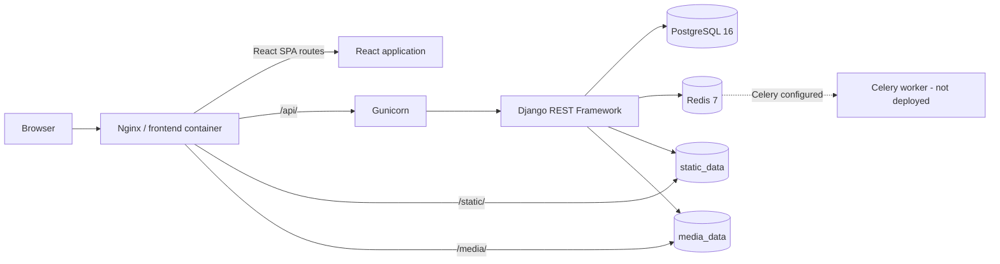
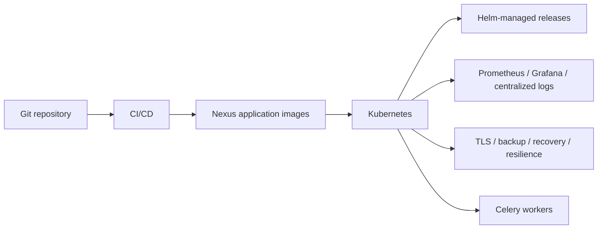

# System Architecture

## Overview

Cloud Native Inventory Platform is a full-stack operations workload for a DevOps lifecycle portfolio. The application phase is complete: the current implementation runs React and Django behind Nginx, stores operational data in PostgreSQL, and configures Redis for Celery. CI/CD, Kubernetes, Helm, observability, centralized logging, and production deployment hardening belong to the next phase.

## High-Level Architecture



Nginx is the only host-published service in the current Compose topology. It serves the built SPA, proxies API requests to Gunicorn, and serves shared static/media volumes directly.

## Current Implemented Architecture

### Frontend

The frontend is a React/TypeScript SPA built with Vite and styled with Tailwind CSS. TanStack Query owns server state and Axios provides typed API access. The UI contains:

- public login and inactive-by-default registration;
- authenticated account/profile and password flows;
- dashboard, Products/Product Detail, Warehouses, and Inventory;
- inventory adjustment and movement history;
- Orders/Order Detail, status transitions/timeline, and payment execution;
- Admin user approval/role management and Admin/Auditor Audit Log;
- shared loading, empty, error, modal, focus, navigation, pagination, and success-feedback behavior.

The Auth provider stores access/refresh tokens in `localStorage`, refreshes access tokens when appropriate, and clears the browser session on logout or password change. Protected and role-aware routes improve UX; backend permissions remain authoritative.

### Backend

The Django project is split into three main areas:

```text
config/       settings, URL routing, WSGI/ASGI, schema helpers, Celery setup
users/        custom User, authentication/profile APIs, Admin user management, roles
inventory/    domain models, serializers, viewsets, services, tasks, Admin, tests
```

DRF exposes authentication at `/api/auth/` and versioned domain resources at `/api/v1/`. drf-spectacular generates the OpenAPI schema, Swagger UI, and ReDoc with JWT bearer authentication and endpoint tags.

### Domain service layer

Views and serializers validate transport data and delegate multi-record business mutations to services:

```text
HTTP request
    -> DRF view/serializer and permission
        -> domain service
            -> model/database transaction
                -> response serializer
```

- `orders.py` creates nested orders, initializes status history, locks/deducts inventory, snapshots price, and records audit activity atomically.
- `stock.py` owns inventory adjustments and order deductions with `select_for_update`, quantity bounds, negative-stock protection, and movement creation.
- `order_status.py` owns the explicit order state machine, row locking, status history, audit activity, and notification creation.
- `payments.py` owns one-to-one payment locking, amount calculation, mock-provider execution, idempotent success behavior, audit activity, status progression, and notification creation.
- `notifications.py` creates notifications idempotently and schedules delivery after transaction commit.
- `audit.py` validates and writes global audit events.

### Data model

PostgreSQL stores users/groups, products, warehouses, inventory, movements, orders/items, status histories, payments, notifications, and audit logs.

Important relationships and invariants include:

- one Inventory row per product/warehouse pair;
- OrderItems protect their product/warehouse references, movement histories protect Inventory records, and API/Admin deletion boundaries reject any referenced product or warehouse;
- inventory quantity is changed through controlled stock operations, with each change represented by an InventoryMovement;
- OrderItem stores its historical `unit_price` and warehouse;
- Order owns chronological OrderStatusHistory entries;
- Payment is one-to-one with Order;
- business history and AuditLog are read-only through normal API/Admin application paths.

These application-level immutability guarantees do not prevent modification by privileged direct database access or bypassing model methods with queryset-level operations.

## Authentication and RBAC

SimpleJWT provides access and refresh tokens. Public registration creates an inactive account without groups; an application Admin must activate it and select one role. `/api/auth/me/` provides self-profile access, and password changes verify the current password and Django's configured validators.

The four application groups are:

- Admin
- Warehouse Manager
- Operator
- Auditor

Reusable DRF permission classes enforce resource and action rules. In summary:

| Capability | Admin | Warehouse Manager | Operator | Auditor |
|---|---|---|---|---|
| Product/warehouse mutation | Yes | No | No | No |
| Inventory create | Yes | Yes | Yes | No |
| Inventory adjustment | Yes | Yes | No | No |
| Order creation/payment | Yes | No | No | No |
| Operational order transitions | All valid | Processing/shipping only | No | No |
| User administration | Yes | No | No | No |
| Audit log read | Yes | No | No | Yes |

Admin here means membership in the application Admin group. Sensitive application Admin/Audit endpoints deliberately do not grant implicit access to a Django superuser without the required group.

## Transactional Workflows

### Inventory

Manual adjustment locks one inventory record, validates a non-zero delta and reason, prevents negative/overflow stock, updates quantity, creates immutable movement history, and records a global audit event in one transaction. Initial inventory quantity and order deductions use the same controlled stock path.

### Orders

Order creation is authoritative through the API/service and cannot be initiated in Django Admin. It accepts nested product, warehouse, and quantity items; assigns `request.user`; forces pending status; aggregates stock requirements; locks rows deterministically; deducts stock; writes OrderItems with price snapshots; and creates movement/status/audit history. A failure rolls back the complete operation.

Allowed status transitions are:

```text
pending -> processing -> shipped -> delivered
    \             \
     -> cancelled  -> cancelled
```

The transition service validates and locks each update. Status cannot be changed through generic PATCH.

### Payments and notifications

The current local/mock provider persists one Payment per Order. Payment execution is Admin-only and idempotently returns an existing successful payment; a successful pending-order payment uses the status service to move the order to processing.

Notifications are persisted for selected payment/status events. Delivery code, retries, Celery task configuration, and Redis broker/result settings exist. The current Compose topology does **not** run a Celery worker, so asynchronous notification delivery is not an implemented runtime service yet.

### Audit

Global AuditLog entries capture important security and business mutations with actor, action, target type/ID, a label snapshot, validated JSON metadata, and timestamp. Sensitive metadata keys are rejected and metadata size is bounded. API access is read-only for Admin and Auditor.

## Docker Compose Runtime

The implemented Compose stack contains:

| Service | Runtime | Responsibility |
|---|---|---|
| `frontend` | Nginx alpine | SPA, API proxy, static/media files |
| `backend` | Python slim + Gunicorn | Django API and application services |
| `postgres` | PostgreSQL 16 alpine | Durable relational data |
| `redis` | Redis 7 alpine | Health-visible Celery broker/result backend |

The backend depends on healthy PostgreSQL and Redis; the frontend depends on the healthy backend. The backend healthcheck uses process-only liveness.

### Nexus base-image flow

The control-plane lab consumes external base images through the Nexus `docker-all` pull group at `192.168.122.1:8082`. Compose supplies `NEXUS_DOCKER_GROUP=192.168.122.1:8082/base`, producing paths such as:

```text
192.168.122.1:8082/base/python:3.14-slim
192.168.122.1:8082/base/node:22-alpine
192.168.122.1:8082/base/nginx:alpine
192.168.122.1:8082/base/postgres:16-alpine
192.168.122.1:8082/base/redis:7-alpine
```

This address is lab-specific, not a production default. Dockerfiles accept `PYTHON_BASE_IMAGE`, `NODE_BASE_IMAGE`, and `NGINX_BASE_IMAGE` build arguments rather than embedding it. Nexus `docker-hosted` is the intended push repository; automated application-image build/push is future CI/CD work.

### Persistence and file delivery

```text
PostgreSQL -> /var/lib/postgresql/data -> postgres_data
Django collectstatic -> /app/staticfiles -> static_data -> Nginx /var/www/static:ro -> /static/
Django uploads      -> /app/media       -> media_data  -> Nginx /var/www/media:ro  -> /media/
```

Static and media delivery has been runtime-verified with `DEBUG=False`; media is not proxied to Gunicorn. Named volumes are durable for a single-host Compose deployment, not a multi-node storage design.

Nginx scopes `client_max_body_size 6m` to `/api/`. The extra headroom allows a valid 5 MiB multipart product image to reach Django. Django validates the actual image format and 5 MiB file maximum and returns `400` for oversized files.

## Health Architecture

- `/api/health/live/` confirms only that Django can answer; it performs no dependency I/O.
- `/api/health/ready/` executes PostgreSQL `SELECT 1`; database failure returns `503`. Redis does not control readiness.
- `/api/health/dependencies/` checks PostgreSQL and Redis for monitoring/troubleshooting and reports healthy, degraded, or unhealthy.

## Application Freeze Baseline

- Django system check: pass
- Migrations applied through `inventory.0008_auditlog`
- `makemigrations --check --dry-run`: no changes
- Full backend suite: 246 tests passing on the control-plane PostgreSQL environment
- OpenAPI validation: no errors or warnings
- Nginx configuration validation: pass
- Manual E2E: complete

The application phase is complete and ready for freeze. The frontend currently has no automated test suite; it is validated through linting, TypeScript/production build checks, and manual E2E.

## Future DevOps Architecture

The next phase will add, rather than claim as current:



Production TLS, secret management, image promotion, deployment automation, multi-node persistence, monitoring, centralized logging, backups, and recovery procedures are not implemented by the current Compose application runtime.
