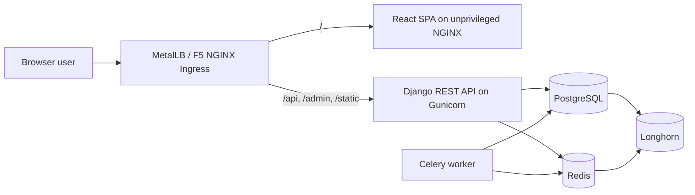
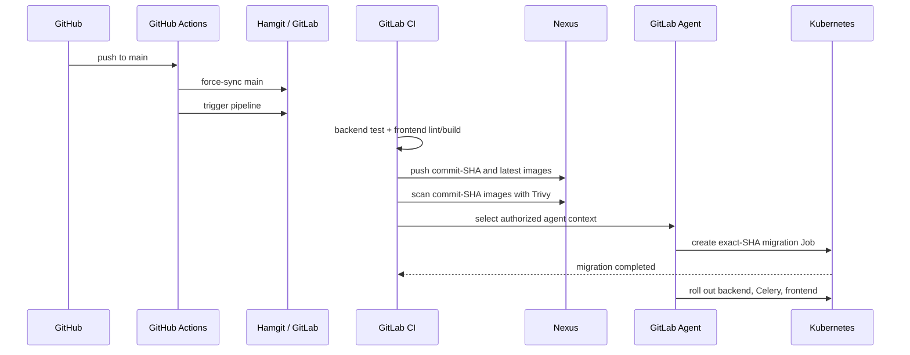
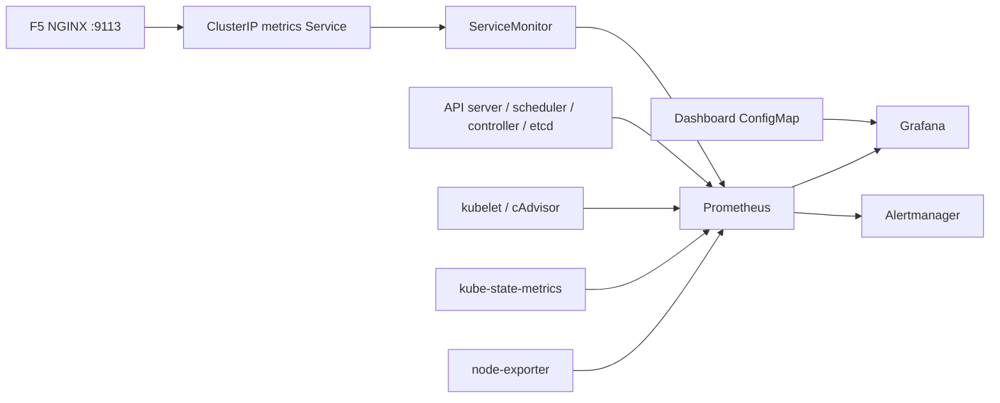

# Architecture

## Purpose and scope

Cloud Native Inventory Platform is a production-oriented lab, not a claim of a production service. A functional inventory application supplies realistic transactions, permissions, asynchronous work, state, and failure modes; the platform layer demonstrates how that workload is built, checked, released, isolated, and observed.

## System context

```mermaid
flowchart LR
  User[Browser user] --> Edge[MetalLB / F5 NGINX Ingress]
  Edge -->|/| Web[React SPA on unprivileged NGINX]
  Edge -->|/api, /admin, /static| API[Django REST API on Gunicorn]
  API --> DB[(PostgreSQL)]
  API --> Broker[(Redis)]
  Worker[Celery worker] --> Broker
  Worker --> DB
  DB --> Longhorn[(Longhorn)]
  Broker --> Longhorn
```

The Kubernetes Ingress routes API traffic directly to the backend Service. The frontend container's `/api/` reverse proxy exists for Compose, where NGINX is the single browser entry point.

## Delivery architecture

```mermaid
sequenceDiagram
  participant GH as GitHub
  participant GA as GitHub Actions
  participant GL as Hamgit / GitLab
  participant CI as GitLab CI
  participant NX as Nexus
  participant KA as GitLab Agent
  participant K8s as Kubernetes

  GH->>GA: push to main
  GA->>GL: force-sync main
  GA->>GL: trigger pipeline
  CI->>CI: backend test + frontend lint/build
  CI->>NX: push commit-SHA and latest images
  CI->>NX: scan commit-SHA images with Trivy
  CI->>KA: select authorized agent context
  KA->>K8s: create exact-SHA migration Job
  K8s-->>CI: migration completed
  KA->>K8s: roll out backend, Celery, frontend
```

`latest` is published as a convenience tag but is not used by Kubernetes. Tracked workload manifests contain `ci-render-required`; the deploy job verifies and replaces exactly one placeholder in each temporary manifest.

## Runtime components

| Component | Replicas | Port | Persistence | Responsibility |
|---|---:|---:|---|---|
| Frontend | 2 | 8080 | Longhorn 2 GiB RWX media (read-only) | Static React bundle, SPA routing, and media delivery |
| Backend | 2 | 8000 | Longhorn 2 GiB RWX media; `emptyDir` static/tmp | REST API, admin, health, business rules |
| Celery | 1 | n/a | None | Notification delivery tasks |
| PostgreSQL | 1 | 5432 | Longhorn 1 GiB RWO PVC | Authoritative application state |
| Redis | 1 | 6379 | Longhorn 1 GiB RWO PVC | Celery broker/result backend, AOF every second |

PostgreSQL and Redis are single-replica lab services. Longhorn protects storage from a single local disk dependency but does not make the database or broker highly available.

## Health model

- `/api/health/live/` proves the Django process can respond; it performs no dependency I/O.
- `/api/health/ready/` runs `SELECT 1` against PostgreSQL and returns `503` when unavailable.
- `/api/health/dependencies/` reports PostgreSQL and Redis separately for diagnosis. Redis degradation does not remove the synchronous API from readiness.
- Frontend probes request `/` from NGINX.
- PostgreSQL uses `pg_isready`; Redis uses `redis-cli ping`.

## Security boundaries

The `inventory` namespace enforces the Kubernetes Restricted Pod Security profile. Application pods run as explicit non-root UIDs, drop all capabilities, disable privilege escalation, use `RuntimeDefault` seccomp, and do not mount ServiceAccount tokens. Backend, frontend, and Celery use read-only root filesystems with explicit writable volumes. PostgreSQL and Redis require writable image/data paths and therefore do not declare a read-only root.

Default-deny policies are followed by narrow allowances for Ingress-to-web/API, API/worker-to-PostgreSQL, API/worker-to-Redis, and DNS. The GitLab Agent deployer has namespace-scoped workload permissions and no Secret read verb.

## Persistence and file delivery

Compose shares named `static_data` and `media_data` volumes from Django to NGINX. Kubernetes uses one 2 GiB Longhorn `ReadWriteMany` claim on the dedicated `longhorn-media` StorageClass: backend replicas write `/app/media`, frontend replicas mount the same data read-only at `/var/www/media`, and Ingress routes `/media` to frontend NGINX. `longhorn-media` requests two replicas and selects only default disks tagged `application`; monitoring disks remain isolated through their `monitoring` tag and `longhorn-monitoring` class. The target cluster must support Longhorn RWX volumes (share-manager/NFS); every node that may run a backend or frontend replica must provide an NFS client (`nfs-common` on Ubuntu); production deployments should prefer object storage and a dedicated media delivery layer.

PostgreSQL and Redis use the external `longhorn` StorageClass. Monitoring uses the external `longhorn-monitoring` StorageClass with 5 GiB for Prometheus and 1 GiB for Grafana. The repository defines only the application-media `longhorn-media` StorageClass; all StorageClasses and Longhorn disk tags are platform-bootstrap responsibilities.

## Observability architecture

```mermaid
flowchart LR
  NE[node-exporter] --> P[Prometheus]
  KSM[kube-state-metrics] --> P
  Kubelet[kubelet / cAdvisor] --> P
  CP[API server / scheduler / controller / etcd] --> P
  NIC[F5 NGINX :9113] --> SVC[ClusterIP metrics Service]
  SVC --> SM[ServiceMonitor]
  SM --> P
  P --> G[Grafana]
  P --> AM[Alertmanager]
  Dashboard[Dashboard ConfigMap] --> G
```

The NGINX controller is installed outside this repository. The repository owns a small JSON patch that appends metrics flags, a private metrics Service, and a ServiceMonitor selected through `release: monitoring`. See [Observability](observability.md).

## Ownership boundaries

| Tracked and applied by application CI | Tracked, but bootstrapped manually | External prerequisite |
|---|---|---|
| Workload ServiceAccounts | Namespace and Pod Security labels | kubeadm nodes and Calico |
| Backend/frontend Services | Backend ConfigMap, runtime Secrets, and `longhorn-media` StorageClass/PVC | Longhorn and external StorageClasses |
| Ingress and NetworkPolicies | PostgreSQL/Redis Services and StatefulSets | MetalLB and F5 NGINX installation |
| Exact-SHA migration/backend/Celery/frontend | GitLab Agent RBAC/chart values | Nexus repositories and mirrored images |
| | Monitoring Helm values/metrics resources/dashboard | Firewall/DNS/host routing |

This split prevents the application release job from gaining cluster-bootstrap or Secret permissions, but it means a new cluster requires an explicit platform bootstrap.

## Current constraints

- No production TLS, external secret controller, centralized logging, backup automation, or disaster-recovery rehearsal
- No highly available PostgreSQL, Redis, Prometheus, or Grafana topology
- Lab media depends on two schedulable `application`-tagged replicas and Longhorn RWX/share-manager; production object storage, media backup, and lifecycle automation are not implemented
- No repository-managed cluster provisioning
- No custom Alertmanager receiver configuration or proof of notification delivery
- No Metrics Server manifest; Prometheus does not provide the Metrics API used by `kubectl top`
