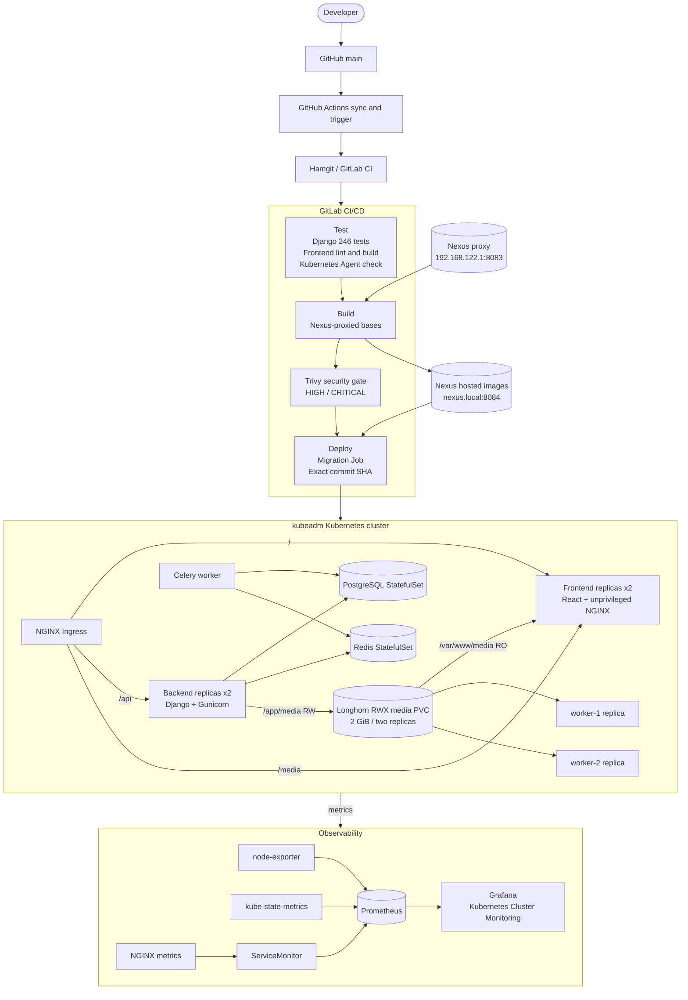

# Portfolio Architecture

This diagram presents the verified delivery, runtime, storage, and observability paths of the Cloud Native Inventory Platform. It describes a production-oriented kubeadm lab, not a public-cloud or production-HA deployment.

## Reading the diagram

- CI pulls build/test dependencies through the internal Nexus proxy on `192.168.122.1:8083`; it publishes application images to the separate hosted registry exposed as `nexus.local:8084`.
- Trivy scans exact commit-SHA images before the deploy stage can run.
- NGINX Ingress routes browser, API, and media traffic. The frontend reads the same media volume that backend replicas write.
- Prometheus discovers infrastructure and NGINX signals; Grafana loads the version-controlled dashboard.

Rendered versions: [SVG](architecture.svg) and [PNG](architecture.png).
